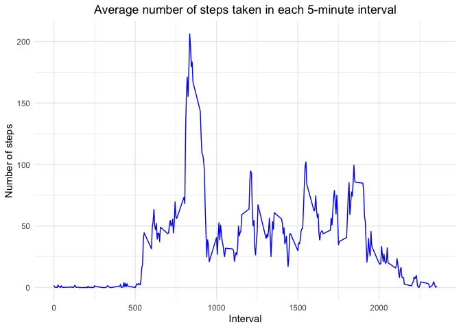
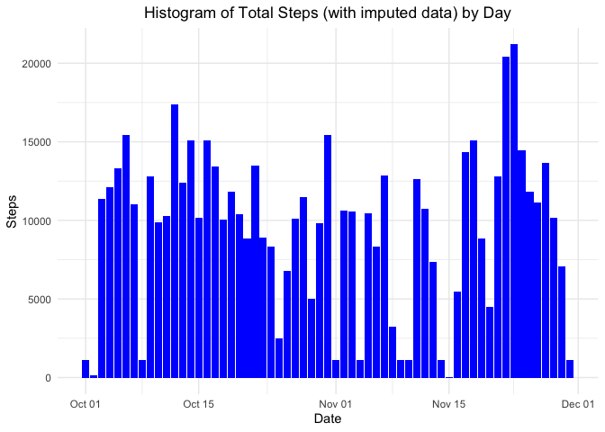
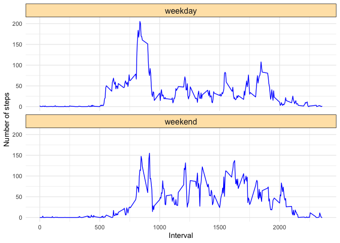

```r
# Load packages
library(dplyr)
library(ggplot2)
library(lubridate)
library(knitr)

options(dplyr.summarise.inform = FALSE)
```

## Loading and preprocessing the data

The data is contained in a zipped file. We unzip the file and read the csv file.


```r
# Unzip file
unzip("activity.zip")
# Read csv file
activity <- read.csv("activity.csv")
# Format date column
activity$date = ymd(activity$date)
```


## What is mean total number of steps taken per day?

1. Calculate the total number of steps taken per day


```r
total_steps <- activity %>% 
  group_by(date) %>% 
  summarise(steps = sum(steps, na.rm = TRUE))
```

2. Make a histogram of the total number of steps taken each day


```r
p1 <- ggplot(total_steps, aes(x = date, y = steps)) + 
  geom_bar(stat = 'identity', fill = 'blue') + 
  xlab("Date") + 
  ylab("Steps") + 
  ggtitle("Histogram of Total Steps by Day") + 
  theme_minimal() + 
  theme(plot.title = element_text(hjust = 0.5))

p1
```

<!-- -->

```r
suppressMessages(ggsave(filename = "./figure/plot1.png", plot = p1))
```

3. Calculate and report the mean and median of the total number of steps taken per day


```r
# Mean of the total number of steps per day
mean_steps <- mean(total_steps$steps, na.rm = TRUE)
mean_steps
```

```
## [1] 9354.23
```

```r
# Median of the total number of steps per day
median_steps <- median(total_steps$steps, na.rm = TRUE)
median_steps
```

```
## [1] 10395
```

The mean of the total number of steps taken per day is 9354, and the median of the total number of steps taken per day is 1.0395\times 10^{4}. 

## What is the average daily activity pattern?

1. Make a time series plot (i.e. type = "l") of the 5-minute interval (x-axis) and the average number of steps taken, averaged across all days (y-axis)


```r
# Calculate average number of steps by 5-minute interval
interval_mean <- activity %>% 
  group_by(interval) %>% 
  summarise(mean_steps = mean(steps, na.rm = TRUE))

# Time serise plot
p2 <- ggplot(interval_mean, aes(x = interval, y = mean_steps)) + 
  geom_line(color = "blue") + 
  xlab("Interval") + 
  ylab("Number of steps") + 
  ggtitle("Average number of steps taken in each 5-minute interval") + 
  theme_minimal() + 
  theme(plot.title = element_text(hjust = 0.5))

p2
```

<!-- -->

```r
suppressMessages(ggsave(filename = "./figure/plot2.png", plot = p2))
```


2. Which 5-minute interval, on average across all the days in the dataset, contains the maximum number of steps?


```r
max_interval <- interval_mean$interval[which.max(interval_mean$mean_steps)]
max_interval
```

```
## [1] 835
```

The 835th 5-minute interval, on average across all the days, contains the maximum number of steps.

## Imputing missing values

1. Calculate and report the total number of missing values in the dataset (i.e. the total number of rows with NAs)


```r
# Only steps column has NA, so we count how mnay rows with NAs in steps
total_na <- sum(is.na(activity$steps))
total_na
```

```
## [1] 2304
```

A total of 2304 rows have NAs in the dataset.

2. Devise a strategy for filling in all of the missing values in the dataset. The strategy does not need to be sophisticated. For example, you could use the mean/median for that day, or the mean for that 5-minute interval, etc.

Here we plan to use the median for the 5-minute interval across all days to impute missing values.

3. Create a new dataset that is equal to the original dataset but with the missing data filled in.


```r
# Median of steps for each 5-minute interval, across all days
interval_median <- activity %>% 
  group_by(interval) %>% 
  summarise(median_steps = median(steps, na.rm = TRUE))

# Impute missing data with median for that 5-minute interval
activity_imputed <- activity %>% 
  left_join(interval_median, by = "interval") %>% 
  mutate(steps = if_else(is.na(steps), median_steps, steps)) %>% 
  select(-median_steps)
```

4. Make a histogram of the total number of steps taken each day and Calculate and report the mean and median total number of steps taken per day. Do these values differ from the estimates from the first part of the assignment? What is the impact of imputing missing data on the estimates of the total daily number of steps?


```r
# Calculate total number of steps for each day
total_steps_imputed <- activity_imputed %>% 
  group_by(date) %>% 
  summarise(steps = sum(steps))

# Histogram of total number of steps by day
p3 <- ggplot(total_steps_imputed, aes(x = date, y = steps)) + 
  geom_bar(stat = 'identity', fill = 'blue') + 
  xlab("Date") + 
  ylab("Steps") + 
  ggtitle("Histogram of Total Steps (with imputed data) by Day") + 
  theme_minimal() + 
  theme(plot.title = element_text(hjust = 0.5))

p3
```

<!-- -->

```r
suppressMessages(ggsave(filename = "./figure/plot3.png", plot = p3))
```


```r
# Mean of the total number of steps per day with imputed data
mean_steps_imputed <- mean(total_steps_imputed$steps, na.rm = TRUE)
mean_steps_imputed
```

```
## [1] 9503.869
```

```r
# Median of the total number of steps per day with imputed data
median_steps_imputed <- median(total_steps_imputed$steps, na.rm = TRUE)
median_steps_imputed
```

```
## [1] 10395
```

The mean of the total number of steps taken per day is 9354 without imputation, and is 9504 with imputed data. The median of the total number of steps taken per day is 1.0395\times 10^{4} without imputation, and is 1.0395\times 10^{4} with imputed data.

The median of total number of steps do not change, as expected, because we imputed missing values with medians. However, the means are greater. 

## Are there differences in activity patterns between weekdays and weekends?

1. Create a new factor variable in the dataset with two levels – “weekday” and “weekend” indicating whether a given date is a weekday or weekend day.


```r
activity_imputed$wday <- ifelse(weekdays(activity_imputed$date) %in% c("Saturday", "Sunday"), "weekend", "weekday")
activity_imputed$wday <- as.factor(activity_imputed$wday)
```


2. Make a panel plot containing a time series plot (i.e. type = "l") of the 5-minute interval (x-axis) and the average number of steps taken, averaged across all weekday days or weekend days (y-axis). See the README file in the GitHub repository to see an example of what this plot should look like using simulated data.


```r
# Calculate average number of steps in 5-minute intervals by weekday/weekend days
mean_steps_wday <- activity_imputed %>% 
  group_by(wday, interval) %>% 
  summarise(steps = mean(steps))

# Panel plot of time series plot
p4 <- ggplot(mean_steps_wday, aes(x = interval, y = steps)) + 
  geom_line(color = 'blue') + 
  facet_wrap(~wday, ncol = 1) + 
  xlab("Interval") + 
  ylab("Number of steps") + 
  theme_minimal() + 
  theme(strip.background = element_rect(fill = 'moccasin'), 
        strip.text = element_text(size=12))

p4
```

<!-- -->

```r
suppressMessages(ggsave(filename = "./figure/plot4.png", plot = p4))
```


